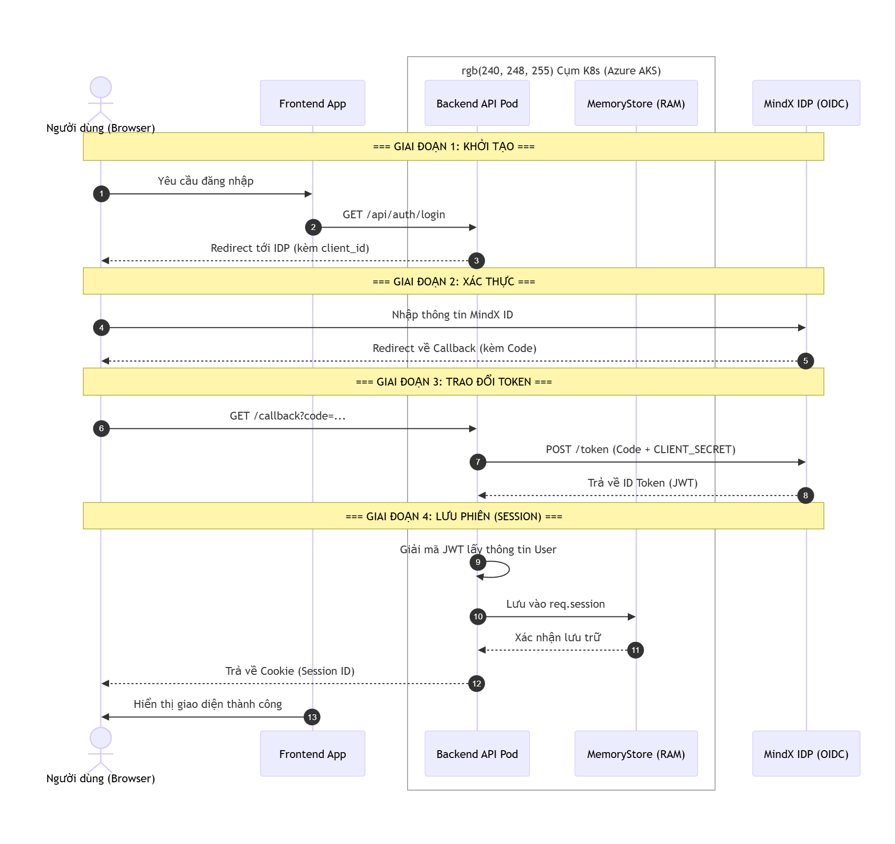

# Tài liệu Kỹ thuật: Luồng Xác thực Hệ thống

## 1. Tổng quan về Giao thức và Tiêu chuẩn (Protocol & Standards)

Hệ thống triển khai cơ chế xác thực dựa trên giao thức **OpenID Connect (OIDC)**, một lớp định danh (Identity Layer) được xây dựng phía trên nền tảng khung ủy quyền **OAuth 2.0**. Việc áp dụng tiêu chuẩn này giúp dự án đạt được các tiêu chí bảo mật cấp độ doanh nghiệp (Enterprise Security).

### 1.1. Phân tích nền tảng OIDC

- **Xác thực (Authentication)**: Kiểm chứng danh tính người dùng thông qua hệ thống Identity Provider (IDP) tập trung của MindX.

- **Ủy quyền (Authorization)**: Cấp quyền truy cập vào các tài nguyên cụ thể dựa trên các phạm vi (Scopes) đã được định nghĩa (`openid`, `profile`, `email`).

- **ID Token**: Thông tin định danh được đóng gói dưới định dạng **JSON Web Token (JWT)**, đảm bảo tính toàn vẹn thông qua chữ ký số và cho phép Backend trích xuất dữ liệu người dùng (Claims) mà không cần truy vấn lặp lại tới IDP.

## 2. Chi tiết Luồng Authorization Code Grant (Technical Breakdown)

Triển khai mô hình **Authorization Code Flow**, đây là mô hình bảo mật tối ưu nhất cho các ứng dụng có thành phần Backend (Confidential Clients), giúp bảo vệ bí mật ứng dụng (`CLIENT_SECRET`) khỏi môi trường không an toàn như trình duyệt người dùng.

### 2.1. Giai đoạn 1: Khởi tạo và Điều hướng (Initiation & Redirection)

- **Hành động**: Khi người dùng yêu cầu xác thực tại Endpoint `/api/auth/login`, hệ thống thực hiện kiểm tra trạng thái phiên hiện hành.

- **Kỹ thuật**: Nếu chưa xác thực, Backend thực hiện lệnh điều hướng (HTTP 302 Redirect) tới Authorization Endpoint của MindX ID kèm các tham số kỹ thuật bắt buộc: `client_id`, `response_type=code`, và `scope`.

### 2.2. Giai đoạn 2: Xác thực Người dùng và Cấp mã (User Consent & Authorization Code)

- **Hành động**: Người dùng tương tác trực tiếp với giao diện của IDP để cung cấp thông tin định danh.

- **Kỹ thuật**: Sau khi xác thực thành công, IDP thực hiện điều hướng quay lại ứng dụng thông qua đường dẫn callback kèm theo một mã ủy quyền tạm thời (**Authorization Code**).

### 2.3. Giai đoạn 3: Trao đổi Token qua Back-channel (Server-to-Server Exchange)

Đây là giai đoạn then chốt nhằm đảm bảo tính bảo mật cho thông tin nhạy cảm:

- **Yêu cầu**: Backend thực hiện một yêu cầu POST trực tiếp tới Token Endpoint của MindX ID.

- **Tham số**: Gửi mã `code` nhận được cùng với `CLIENT_SECRET` (được lưu trữ an toàn trong Kubernetes Secrets trên cụm AKS).

- **Kết quả**: Hệ thống nhận về bộ Token bao gồm **Access Token** và **ID Token** chứa các thông tin người dùng (Claims).

### 2.4. Giai đoạn 4: Thiết lập và Duy trì Phiên (Session Establishment)

- **Xử lý**: Backend giải mã và kiểm tra tính hợp lệ của ID Token để trích xuất danh tính người dùng.

- **Persistence**: Thông tin định danh được đồng bộ hóa vào đối tượng `req.session` thông qua Middleware `express-session` để duy trì trạng thái đăng nhập.

## 3. Quản lý Phiên và Ràng buộc Kỹ thuật (System Constraints)

### 3.1. Cơ chế Lưu trữ MemoryStore

Ứng dụng sử dụng **MemoryStore** mặc định để quản lý trạng thái phiên làm việc của người dùng.

- **Nguyên lý**: Toàn bộ dữ liệu Session được duy trì trực tiếp trong không gian bộ nhớ RAM của tiến trình Node.js đang thực thi bên trong Pod.

- **Đặc tính**: Cung cấp tốc độ truy xuất dữ liệu tối ưu với độ trễ (Latency) ở mức tối thiểu do không phát sinh các truy vấn I/O tới cơ sở dữ liệu bên ngoài.

### 3.2. Ràng buộc trong Môi trường Kubernetes (AKS)

Việc vận hành MemoryStore trên hạ tầng **Azure Kubernetes Service (AKS)** tạo ra các thách thức về tính bền vững (Durability) và khả năng mở rộng (Scalability):

- **Tính không bền vững (Volatility)**: Do tính chất linh hoạt của Kubernetes, các Pod có thể bị khởi động lại hoặc tái triển khai bất cứ lúc nào. Khi đó, toàn bộ dữ liệu phiên trong bộ nhớ RAM sẽ bị xóa sạch, dẫn đến việc người dùng bị mất trạng thái đăng nhập đột ngột.

- **Phân mảnh Phiên (Session Fragmentation)**: Trong môi trường đa bản sao (Multiple Replicas), Ingress Controller có thể điều hướng yêu cầu của người dùng sang các Pod khác nhau. Nếu không cấu hình cơ chế **Session Affinity (Sticky Sessions)**, người dùng sẽ liên tục bị yêu cầu tái đăng nhập do dữ liệu Session chỉ tồn tại cục bộ tại một Pod duy nhất.

## 4. Cấu hình Hạ tầng và Bảo mật (Infrastructure & Security)

Hệ thống đảm bảo tính toàn vẹn của luồng xác thực thông qua sự phối hợp chặt chẽ giữa mã nguồn và hạ tầng triển khai:

- **Ingress Routing**: Sử dụng Nginx Ingress với chỉ thị `rewrite-target` để ánh xạ chính xác các yêu cầu từ Gateway vào dịch vụ Backend API.

- **Secrets Management**: Toàn bộ thông tin nhạy cảm của giao thức OIDC (như `CLIENT_SECRET`) được quản lý tập trung qua **Kubernetes Secrets** và được tiêm (Inject) vào ứng dụng dưới dạng biến môi trường lúc Runtime.

- **Logging & Monitoring**: Mọi nỗ lực truy cập trái phép hoặc lỗi phiên làm việc đều được ghi nhận chi tiết (ví dụ qua mã lỗi `401 Unauthorized`) để phục vụ công tác chẩn đoán sự cố kịp thời.

## 5. Phụ lục: Biểu đồ Luồng Kỹ thuật (Technical Flow Diagram)

