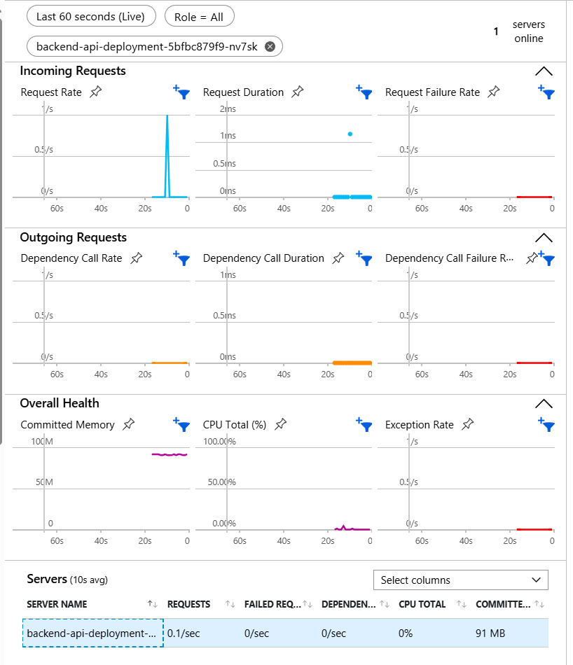
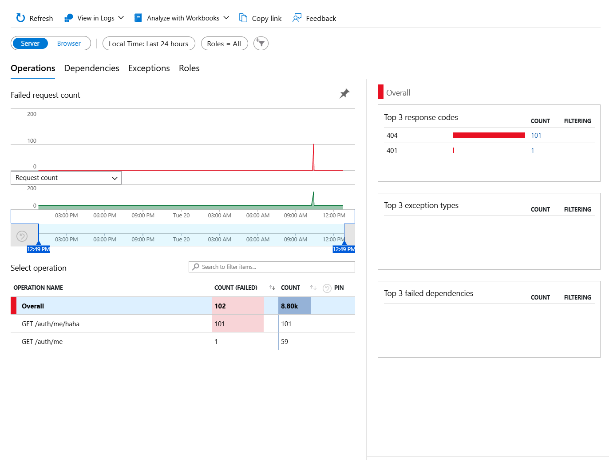
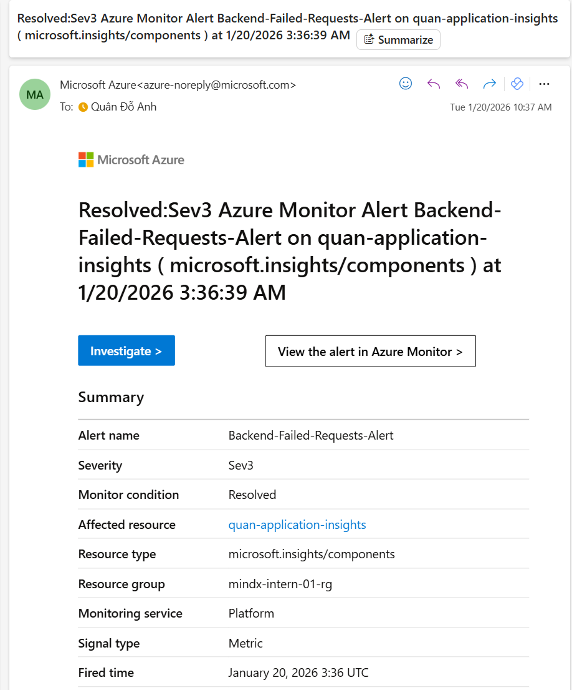
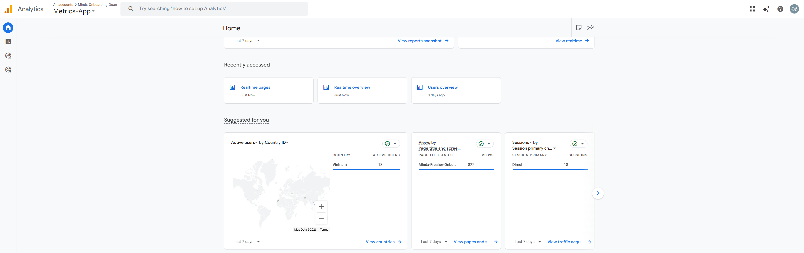

# MindX Onboarding - Week 2: Observability & Monitoring

## 1. Mục tiêu và Phạm vi (Objectives & Scope)
Bản demo này được thiết kế để minh chứng khả năng **quản trị vận hành dựa trên dữ liệu thực tế (Data-driven Operations)**, không chỉ giám sát trạng thái hoạt động của máy chủ mà còn đi sâu vào việc chẩn đoán lỗi, phản ứng sự cố tự động và phân tích hành vi người dùng cuối.

---

## 2. Chức năng 1:  APM Live Metrics
**Mô tả chức năng:** Cung cấp một "bảng điều khiển trung tâm" hiển thị sức khỏe của ứng dụng Backend chạy trên cụm **Azure Kubernetes Service (AKS)** với độ trễ cập nhật **dưới 1 giây**.

### Cơ chế vận hành:
*   **Kết nối đa điểm:** Hệ thống ghi nhận mọi phiên bản (Pod) của ứng dụng đang hoạt động đồng thời trên Cloud.
*   **Định lượng tài nguyên:** Theo dõi trực tiếp mức độ tiêu thụ CPU và RAM để ngăn chặn các sự cố tràn bộ nhớ hoặc nghẽn CPU trước khi người dùng phát hiện.
*   **Theo dõi lưu lượng (Request Throughput):** Ghi nhận tần suất yêu cầu trên giây (RPS), cho phép đánh giá tải trọng thực tế của hệ thống.

### Minh chứng hoạt động:

*   **Xác thực:** Hình ảnh cho thấy hệ thống đang ghi nhận **01 Server trực tuyến** 
(`backend-api-deployment-...`).
*   **Dữ liệu thực:** Biểu đồ **Incoming Requests** và **Server Health** đang nhảy số liên tục, khớp với thời gian thực hiện kiểm thử thực tế.

---

## 3. Chức năng 2: Deep Failure Diagnostics

**Mô tả chức năng:**  Hệ thống tự động bắt lỗi và phân loại mọi yêu cầu không thành công, cung cấp đầy đủ ngữ cảnh kỹ thuật để đội ngũ phát triển sửa lỗi chính xác.

### Cơ chế vận hành:
*   **Phân loại mã lỗi:** Tự động nhóm các lỗi theo mã trạng thái HTTP (401, 404, 500...) để xác định nhanh lỗi do phía Client hay Server.
*   **Xác định vị trí (Operation Name):** Chỉ ra chính xác đường dẫn (Endpoint) nào đang phát sinh lỗi (ví dụ: `/auth/me/haha`).
*   **Drill-into Analysis:** Cho phép kỹ sư nhấp vào từng mẫu lỗi để xem **dấu vết ngăn xếp (Stack Trace)** và các thông tin định danh của yêu cầu đó.

### Minh chứng hoạt động:
*   **Xác thực:** Dashboard ghi nhận tổng cộng **bao nhiêu yêu cầu thất bại**.
*   **Phân tích chi tiết:** Ví dụ bao nhiêu lỗi được ghi nhận tại `/auth/me/haha` và  lỗi tại `/auth/me`, tất cả đều mang mã **401 Unauthorized**.

---

## 4. Chức năng 3: Proactive Alerting System

**Mô tả chức năng:** Đây là "hệ thống phòng thủ" tự động. Quản trị viên không cần trực màn hình 24/7 vì hệ thống sẽ chủ động gửi thông báo ngay khi có dấu hiệu bất thường xảy ra.

### Cơ chế vận hành:
*   **Thiết lập ngưỡng (Threshold):** Hệ thống được cấu hình để kích hoạt cảnh báo khi ghi nhận **hơn 5 lỗi trong vòng 5 phút**.
*   **Vòng đời sự cố (Incident Lifecycle):**
    *   **Activated (Kích hoạt):** Gửi Email khi lỗi vượt ngưỡng.
    *   **Resolved (Giải quyết):** Tự động gửi Email thông báo khi hệ thống đã ổn định trở lại dưới mức an toàn.
*   **Đồng bộ thời gian quốc tế:** 
    - Quy chuẩn Quốc tế (UTC): Để đảm bảo tính thống nhất trên toàn cầu, các thông báo Email từ Azure Monitor mặc định sử dụng múi giờ UTC (Coordinated Universal Time).

    - Giờ Địa phương (ICT): Việt Nam nằm ở múi giờ ICT (UTC +7). Do đó, thời gian thực tế tại Việt Nam sẽ nhanh hơn 7 tiếng so với thời gian ghi trên Email.
### Minh chứng hoạt động:
*   **Xác thực:** Hình ảnh email với tiêu đề **"Resolved:Sev3 Azure Monitor Alert..."**  xác nhận quy trình cảnh báo đã được thiết lập và thử nghiệm thành công.

---

## 5. Chức năng 4: User Behavior Analytics

**Mô tả chức năng:** Tích hợp **Google Analytics 4 (GA4)** để thấu hiểu cách người dùng tương tác với giao diện Frontend, từ đó tối ưu hóa trải nghiệm sản phẩm.

### Cơ chế vận hành:
*   **Real-time Tracking:** Theo dõi số lượng người dùng đang hoạt động thực tế trên trang web tại mỗi mốc thời gian.
*   **SPA Optimization:** Ghi nhận chính xác các lượt xem trang (`page_view`) ngay cả trên ứng dụng **React** mà không cần tải lại trang.
*   **Định lượng tính năng:** Theo dõi tần suất các sự kiện quan trọng để biết tính năng nào được ưa chuộng nhất.

### Minh chứng hoạt động:
*   **Xác thực:** Dashboard GA4 đã ghi nhận dữ liệu thực tế từ phiên làm việc, đáp ứng đúng yêu cầu về việc cung cấp minh chứng cho kết quả tích hợp GA4.

---

## 6. Summary
Hệ thống giám sát được triển khai giúp việc vận hành trở chủ động hơn thông qua các chức năng chính sau:

**Theo dõi trạng thái thực:** Cung cấp các chỉ số về tài nguyên (CPU, RAM) và lưu lượng truy cập trực tiếp của máy chủ trên cụm AKS.

**Quản trị lỗi tập trung:** Tự động ghi lại và phân loại mọi yêu cầu thất bại (như lỗi 401), giúp xác định nhanh nguyên nhân gây ra sự cố.

**Phản ứng sự cố tự động:** Thiết lập luồng cảnh báo qua Email, thông báo ngay lập tức khi lỗi vượt ngưỡng và khi hệ thống đã ổn định trở lại.

**Thấu hiểu người dùng:** Ghi nhận chính xác hành vi và lượt tương tác trên giao diện Frontend để tối ưu hóa trải nghiệm sản phẩm.